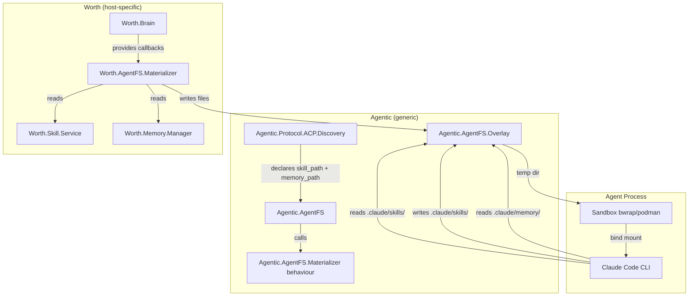

# Agent Filesystem Materialization (AgentFS)

## Goal

Expose Worth skills and Recollect memories as real files to CLI-based coding agents (Claude, OpenCode, Codex, etc.) in a way that works identically on Linux, macOS, and Windows. No FUSE, no /proc tricks, no platform-specific code.

## Architecture



## How It Works

### 1. Discovery Declares Agent Paths

Each agent in `Agentic.Protocol.ACP.Discovery` declares where it expects skills and memories on disk:

```elixir
%{
  name: :claude,
  command: "claude",
  display: "Claude Code",
  skill_path: "~/.claude/skills",        # NEW
  memory_path: "~/.claude/memory",        # NEW
  memory_file: "~/.claude/memory/MEMORY.md",  # NEW (optional, per-agent format)
  directories: %{...}
}
```

This is declarative — no OS-specific code. The agent author says "I look here" and AgentFS makes it so.

### 2. Worth Implements the Materializer

Worth provides a callback module that AgentFS calls to read/write the actual data:

```elixir
defmodule Worth.AgentFS.Materializer do
  @behaviour Agentic.AgentFS.Materializer

  @impl true
  def materialize_skills(opts) do
    workspace = opts[:workspace]
    # Read from Worth.Skill.Service, return list of %{name: ..., content: ...}
    Worth.Skill.Service.list(workspace: workspace)
    |> Enum.map(fn skill -> %{name: skill.name, content: skill.body} end)
  end

  @impl true
  def materialize_memories(opts) do
    workspace = opts[:workspace]
    # Read from Recollect, return structured memory data
    case Worth.Memory.Manager.recent(workspace: workspace, limit: 100) do
      {:ok, entries} -> format_memories(entries)
      _ -> []
    end
  end

  @impl true
  def sync_back_skills(skills_data, opts) do
    # skills_data is list of %{name: ..., content: ..., is_new: bool}
    # Write new skills back to Worth.Skill.Service
    for %{name: name, content: content, is_new: true} <- skills_data do
      Worth.Skill.Service.install(
        %{type: :content, name: name, content: content},
        trust_level: :learned,
        provenance: :agent
      )
    end
    :ok
  end

  @impl true
  def sync_back_memories(memory_content, opts) do
    # Parse modified MEMORY.md, update Recollect
    parse_and_update_memories(memory_content, opts[:workspace])
  end
end
```

### 3. AgentFS Mounts Before Protocol Starts

In `Agentic.Loop.Stages.CLIExecutor`:

```elixir
defp ensure_session(ctx, protocol) do
  if ctx.protocol_session_id do
    ctx
  else
    # NEW: Materialize agent filesystem
    {overlay_path, ctx} = Agentic.AgentFS.mount(ctx)
    
    backend_config = ...
    
    case protocol.start(backend_config, ctx) do
      {:ok, session_id} ->
        %{
          ctx
          | protocol_session_id: session_id,
            protocol_module: protocol,
            transport_type: :local_agent,
            backend_config: backend_config,
            agent_fs_overlay: overlay_path  # NEW: track for cleanup
        }

      {:error, reason} ->
        Agentic.AgentFS.unmount(ctx)  # NEW: cleanup on failure
        raise "Failed to start CLI session: #{inspect(reason)}"
    end
  end
end
```

The `mount` function:
1. Creates a temp directory
2. Calls materializer callbacks to write skills/memories as files
3. Adds the overlay path to `ctx.metadata[:allowed_roots]`
4. Returns the overlay path so it can be cleaned up later

### 4. Overlay Maps to Agent-Expected Paths

This is the key cross-platform trick. Instead of writing to `~/.claude/skills` directly (which might conflict with a real Claude install), we write to a temp dir and **bind-mount it** inside the sandbox at the agent's expected path.

In `Agentic.Sandbox.Runner`, extend `agent_dirs` to support `{host_path, container_path}` tuples:

```elixir
# Current (binds at same path):
["--bind", "/host/path", "/host/path"]

# NEW (custom container path):
["--bind", "/tmp/agentfs-abc123", "/home/user/.claude/skills"]
```

For Windows (no bwrap), we'd copy the files to the actual expected path inside the workspace. Actually, for Windows the sandbox is weaker anyway (`:windows_restricted`), so we can just write files directly into the workspace at the agent's expected relative path.

### 5. Cleanup on Session End

In the stop/terminate path:

```elixir
# After protocol.stop() or session error
Agentic.AgentFS.unmount(ctx)
```

`unmount`:
1. Reads any new/modified files from the overlay
2. Calls `sync_back_*` callbacks
3. Deletes the temp directory

## File Layout in Overlay

```
/tmp/agentfs-{uuid}/
├── skills/
│   ├── worth-memory/
│   │   └── SKILL.md
│   ├── agentic-runtime/
│   │   └── SKILL.md
│   └── my-custom-skill/
│       └── SKILL.md
└── memory/
    └── MEMORY.md
```

Inside the sandbox, this becomes:
```
~/.claude/skills/          (bind mount from /tmp/agentfs-{uuid}/skills/)
├── worth-memory/SKILL.md
├── agentic-runtime/SKILL.md
└── my-custom-skill/SKILL.md
~/.claude/memory/MEMORY.md  (bind mount from /tmp/agentfs-{uuid}/memory/MEMORY.md)
```

## Memory Format

The memory file is Markdown so the agent can read it with its normal `read_file` tool:

```markdown
# Project Memory

## Observation [confidence: 0.9, workspace: my-project]
The project uses Phoenix LiveView for the web interface.

## Decision [confidence: 0.8, workspace: my-project]
We chose SQLite over PostgreSQL for local-first deployment.

## Note [confidence: 0.6, workspace: personal]
User prefers short function names.

---
# Agent-created memories below this line will be synced back to the knowledge store.
```

The agent can append new observations. On unmount, we parse additions after the `---` marker and create Recollect entries.

## Platform Differences

| Platform | Isolation | Skill Path Strategy | Memory Path Strategy |
|----------|-----------|---------------------|----------------------|
| Linux | bwrap (strong) | Bind mount overlay | Bind mount overlay |
| macOS | App Sandbox | Bind mount overlay | Bind mount overlay |
| Windows | Restricted token | Copy to workspace | Copy to workspace |

For Windows, since there's no real sandbox isolation, we write files directly into the workspace directory structure. The agent runs in the same filesystem namespace anyway.

## Files to Create

### In `agentic` (dependency)

1. `lib/agentic/agent_fs.ex` — Main API
2. `lib/agentic/agent_fs/materializer.ex` — Behaviour
3. `lib/agentic/agent_fs/overlay.ex` — Temp dir + file I/O

### In `agentic` (modify)

1. `lib/agentic/protocol/acp/discovery.ex` — Add `skill_path`/`memory_path` to entries
2. `lib/agentic/sandbox/runner.ex` — Support `{host, container}` bind tuples
3. `lib/agentic/loop/stages/cli_executor.ex` — Mount before start, unmount after stop
4. `lib/agentic/loop/stages/acp_executor.ex` — Same mount/unmount hooks

### In `worth`

1. `lib/worth/agent_fs/materializer.ex` — Implements behaviour
2. `lib/worth/brain.ex` — Pass materializer in ctx.callbacks or ctx.metadata
3. `lib/worth/coding_agents.ex` — Map agent protocols to discovery entries for path lookup

## Integration with Worth.Brain

```elixir
# In Worth.Brain.build_callbacks/2
%{
  # ...existing callbacks...
  
  agent_fs_materializer: &Worth.AgentFS.Materializer.materialize/2,
  agent_fs_sync_back: &Worth.AgentFS.Materializer.sync_back/2
}

# Or as metadata
metadata: %{
  workspace: workspace,
  agent_fs_materializer: Worth.AgentFS.Materializer,
  # ...
}
```

## Benefits

1. **Cross-platform**: Works on Linux, macOS, Windows without platform-specific filesystem virtualization
2. **Agent-agnostic**: Each agent declares its own path conventions in the discovery database
3. **Database-backed**: Skills/memories remain in SQLite/Recollect, not scattered across filesystems
4. **Sandbox-safe**: The overlay is disposable. Kill the sandbox, the temp dir gets cleaned up
5. **Sync-back**: Agent-created skills get persisted back to Worth's skill registry
6. **No new tools**: The agent uses `read_file`/`write_file` like normal. No `memory_read`/`skill_read` needed

## Future: Homunculus

In the cloud scenario (homunculus), the exact same code path works:
1. Worth (or homunculus) calls `Agentic.AgentFS.mount(ctx)`
2. The overlay is created in the container's temp dir
3. Container runtime mounts it at the agent's expected path
4. Same sync-back on session end
5. The only difference: `Worth.AgentFS.Materializer` talks to a shared DB instead of local SQLite
